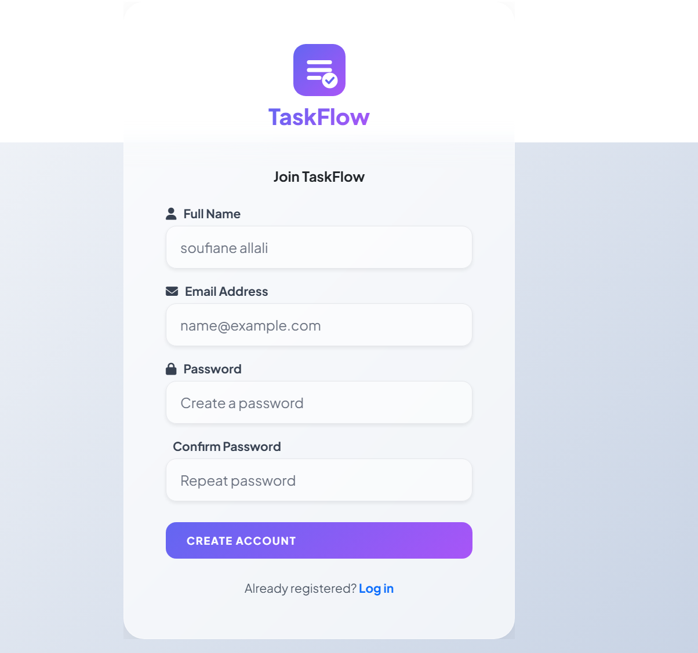
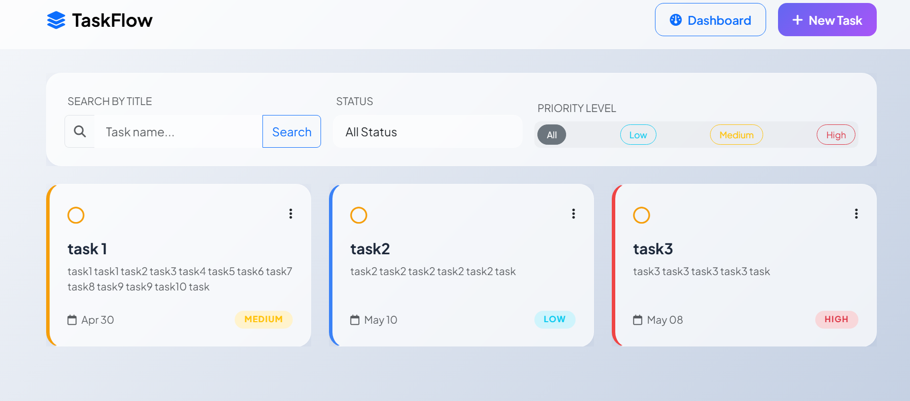
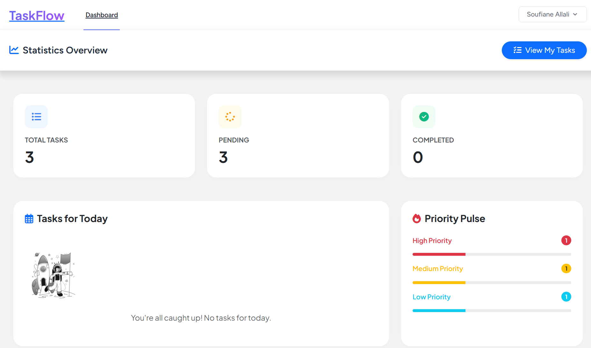
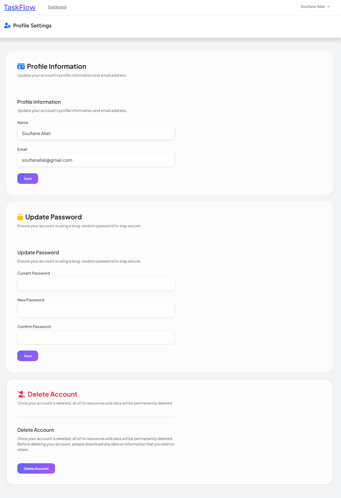

# Task Manager - Laravel

A modern and clean Task Management application built with Laravel Breeze.  
This project helps users organize, track, and manage their daily tasks efficiently.

---

## Features

- Authentication system (Login / Register) using Laravel Breeze
- Full CRUD operations for tasks
- Interactive Dashboard with statistics
- Multi-filter system (status, priority, etc.)
- Priority levels (High / Medium / Low)
- Due date management
- Status toggle (Pending ↔ Completed) with dynamic buttons
- Modern UI using Bootstrap + Custom CSS
- Fully responsive design

---

## Dashboard

The dashboard provides a quick overview of:
- Total Tasks
- Pending Tasks
- Completed Tasks
- Overdue Tasks
- Today’s Tasks

---

##  Technologies Used

- PHP (Laravel)
- Laravel Breeze (Authentication)
- Bootstrap
- JavaScript (for interactions)
- MySQL

---

## Screenshots

